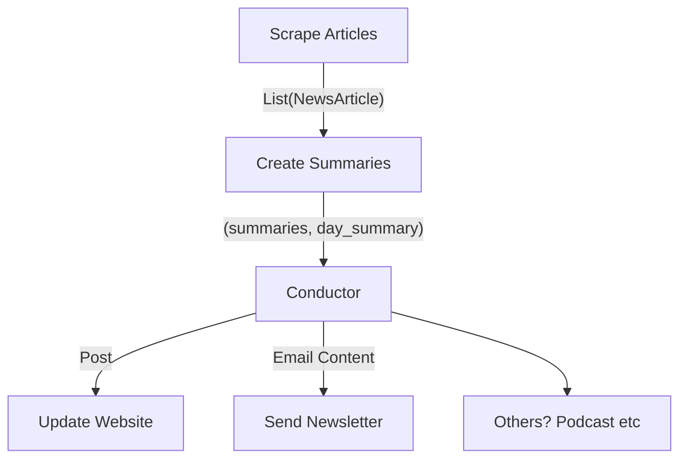

# SG Law Cookies Functions

This repo contains all the code/functions required to run the website.

## Email Support
Function necessary to run a simple newsletter

* Send Confirmation email
* Add member
* Unsubscribe
* Send newsletter

## Workflow

